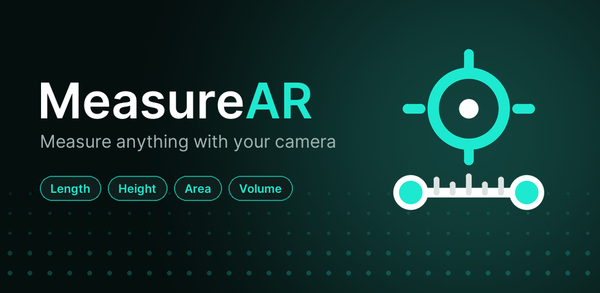

# MeasureAR

Measure anything with your phone's camera: an ARCore tape measure for Android.

**[Download the latest APK](https://github.com/JhaniLive/MeasureAI/releases/latest/download/MeasureAR.apk)** ·
[Website](https://jhanilive.github.io/MeasureAI/) ·
[Privacy policy](https://jhanilive.github.io/MeasureAI/privacy-policy.html)

## Features
- Nine modes: Line, Height, Distance, Angle, Path, Rectangle, Circle, Area, Volume
- Detected surfaces shown as a teal grid; approximate readings marked ≈
- Tap or Stamp to place points, drag to adjust, magnifier for precise aiming
- History with photos, metric / imperial units, bubble level
- No ads, no account, no internet access

## Requirements
An [ARCore-supported](https://developers.google.com/ar/devices) Android phone, Android 8.0+.

## Building
- Debug: `./gradlew :app:assembleDebug`
- Tests (geometry, JVM): `./gradlew :app:testDebugUnitTest`
- Release APK / AAB: `./gradlew :app:assembleRelease` / `:app:bundleRelease`
  (needs `keystore.properties` + keystore at the project root; not in git)
- Store art: `python tools/render_icon.py`, `python tools/render_store_art.py banner`

Built with ♥ by Jhani
